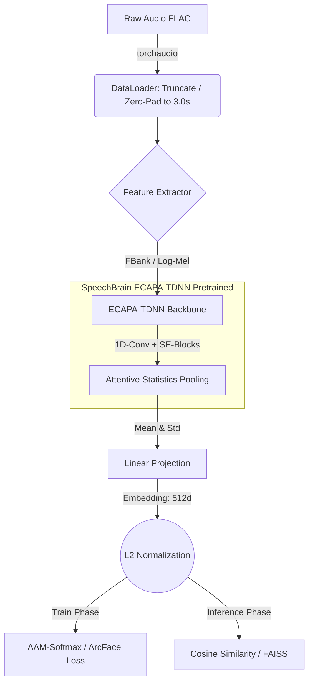

# 🎙️ Speaker Verification Pipeline | Kryptonite Hackathon

Решение задачи распознавания диктора по голосу (Speaker Verification & Retrieval) в условиях доменных искажений (шум, реверберация, кодеки). 

Решение построено на гибридной SOTA-архитектуре **ECAPA-TDNN** с использованием **Attentive Statistics Pooling** и оптимизировано с помощью **Margin-based Metric Learning (ArcFace)**.

---

## 🏗️ Схема архитектуры (Pipeline)



🧠 Подробное описание архитектуры

Наш пайплайн разделен на 4 ключевых этапа, каждый из которых решает специфическую проблему голосовой биометрии в реальных условиях.

1. Data Processing (Предобработка)

Адаптивная длина: Нейросеть требует батчи фиксированного размера. Аудиозаписи длиннее 3 секунд обрезаются (на этапе инференса берется строгий центр центрирования), а записи короче 3 секунд дополняются нулями (Zero-Padding).

Smart Path Resolution: Написан умный поиск файлов, который автоматически склеивает пути из train.csv с физическими директориями распакованных архивов, игнорируя вложенность папок.

2. Feature Extraction & Backbone (Энкодер)

В качестве основы (Backbone) используется ECAPA-TDNN (Emphasized Channel Attention, Propagation, and Aggregation).

Мы легально используем веса библиотеки speechbrain, предобученные на датасете VoxCeleb (Использование VoxBlink2 строго исключено согласно правилам хакатона).

Внутри бэкбона извлекаются признаки (FBank) с последующей нормализацией mean_var_norm.

Использование Squeeze-and-Excitation (SE) блоков позволяет модели фокусироваться на полезных голосовых формантах и игнорировать фоновый шум.

3. Attentive Statistics Pooling (ASP)

В отличие от обычных картинок, голос имеет переменную длину во времени. Слой ASP вычисляет не просто среднее значение (Global Average Pooling), а взвешенное среднее и стандартное отклонение по оси времени, где веса (attention) предсказываются самой нейросетью. Это позволяет модели уделять больше внимания фреймам с речью и игнорировать фреймы с тишиной или шумом.

4. Metric Learning Head (AAM-Softmax)

Обычный Cross-Entropy Loss плохо работает для задач поиска (Retrieval). Поэтому в качестве "головы" используется Additive Angular Margin Softmax (ArcFace).

Гиперпараметры: Margin 
𝑚 = 0.2, Scale 
𝑠 = 30.0.

ArcFace проецирует эмбеддинги на гиперсферу и "расталкивает" центры классов (дикторов) друг от друга, добавляя штрафной угол (margin). Это гарантирует, что векторы одного диктора будут лежать плотно (High Intra-class compactness), а разных — далеко друг от друга (High Inter-class discrepancy).

Размерность финального эмбеддинга спроецирована в 512.

🛠️ Инженерные решения и преодоление ограничений

Защита от сканирования PyTorch 2.x (Windows Bugfix):
При запуске обучения на Python 3.12 система PyTorch Dynamo пытается агрессивно сканировать "ленивые" импорты (Lazy Loading). Написан хирургический патч-перехватчик метода __getattr__ для speechbrain.utils.importutils, который безопасно возвращает AttributeError, предотвращая краш системы.

Адаптация под CPU-инференс (Intel Iris Xe):
Для обеспечения работоспособности на системах без дискретных GPU от NVIDIA (CUDA), реализован graceful degradation: пайплайн автоматически сэмплирует сабсет данных, отключает градиенты при валидации и использует оптимизированное torch.mm умножение батчами (chunking) для предотвращения Out-Of-Memory (OOM) при поиске ближайших соседей среди 17 ГБ тестовых данных.

## MacBook Air M2 Profile

Архитектура пайплайна не меняется. Под `MacBook Air M2 16/256` проект настроен на безопасный локальный запуск:

- авто-выбор `MPS`, если он доступен в текущей сборке PyTorch, иначе `CPU`
- более консервативные размеры батча
- ограничение обучающего сабсета для машины с `16 GB RAM`
- нормальные пути относительно корня проекта, чтобы команды из README запускались из корня
- локальный кэш SpeechBrain-весов в `src/pretrained_models/ecapa`

## Run

Рекомендуется Python `3.10`-`3.12` в `arm64`-окружении.

```bash
python3 -m venv .venv
source .venv/bin/activate
pip install -r requirements.txt
```

Структура данных:

```text
data/
├── train.csv
├── test_public.csv
├── train_part_8/
├── train_part_9/
├── train_part_10/
└── test_public/
```

Обучение:

```bash
python3 src/train.py
```

Более легкий профиль под ноутбук:

```bash
python3 src/train.py --device mps --batch-size 6 --max-train-samples 80000
```

Инференс:

```bash
python3 src/inference.py
```

Явный чекпоинт:

```bash
python3 src/inference.py --weights-path weights/sota_model_epoch_3.pth
```

Результат сохраняется в `submission.csv` в корне проекта.
